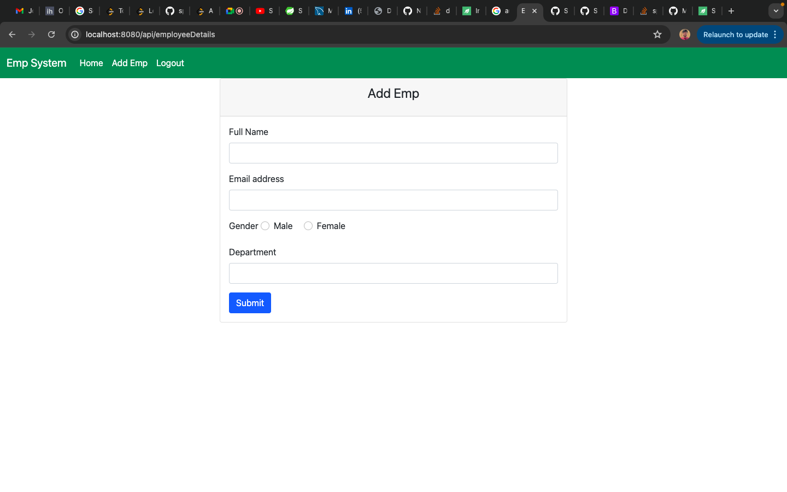
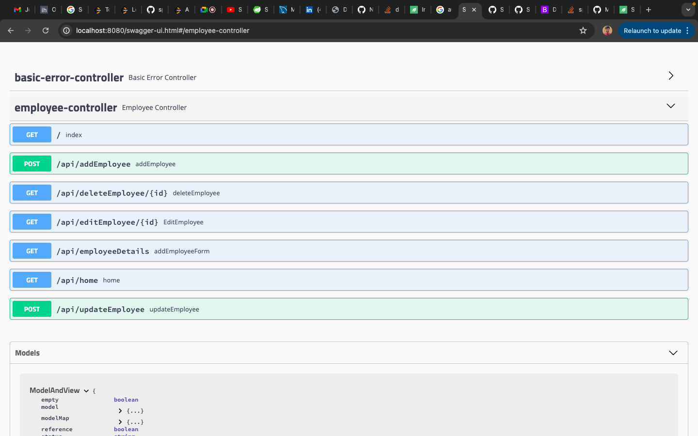

# Employee Management System

### A basic web application which enables to perform CRUD operations for an employee.

#### Details of Application

1. Introduction
   Purpose
   The Employee Management System is designed to efficiently manage employee records within an organization, providing functionalities for CRUD operations (Create, Read, Update, Delete).

Scope
This documentation covers the architecture, functionality, setup, and usage of the Employee Management System.

2. Architecture
   Overview
   The application is developed using the following architecture:

Backend: Spring Boot (MVC, Data JPA)
Frontend: Thymeleaf (HTML templating)
Database: MySQL (or any supported database)
Technologies Used
Java
Spring Boot
Thymeleaf
HTML/CSS/JavaScript
MySQL

3. Functionality
   Features
   Authentication: User login and session management.
   Employee Management:
   View list of employees.
   Add new employee.
   Update employee details.
   Delete employee.
   

Figure 1: Employee List Page

Figure 2: Add Employee Page

Figure 3: List of Avaialble API

[Link to swagger](http://localhost:8080/swagger-ui.html#/employee-controller)

4. Key Components
   Overview of Components
   Controller Layer: Handles incoming requests and delegates to service layer.
   Service Layer: Contains business logic and interacts with repositories.
   Repository Layer: Interface with Spring Data JPA for database operations.
   View Layer: Thymeleaf templates for rendering HTML pages.
   Database Schema: Defines tables and relationships (MySQL used in this example).
5. Setup and Installation
   Requirements
   Java Development Kit (JDK)
   Maven
   MySQL (or any supported database)
   Installation Steps
   Clone the repository: git clone <repository-url>
   Navigate to project directory: cd employee-management-system
   Build the project: mvn clean install
   Configure database credentials in application.properties.
   Run the application: mvn spring-boot:run
6. Usage
   How to Use the Application
   Access the application at http://localhost:8080.
   Log in with credentials (Note default credentials username=admin password=admin).
   Navigate through the interface to manage employees.
   Perform CRUD operations on employees.
   Logout after usage.
